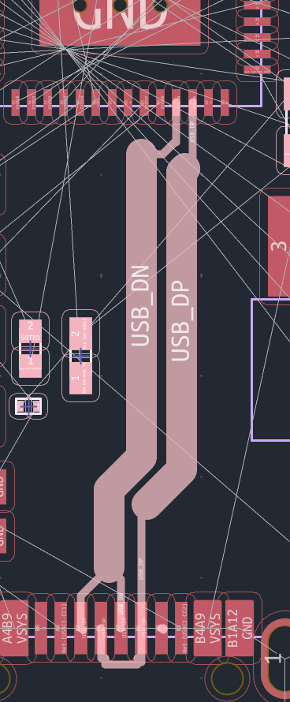
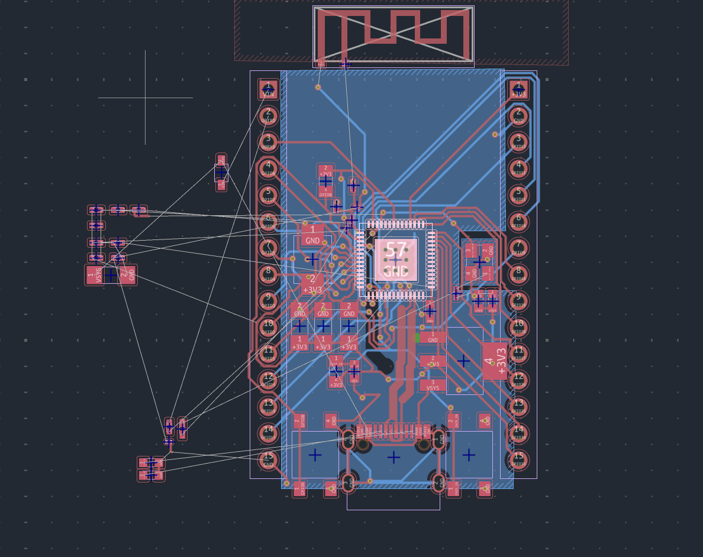
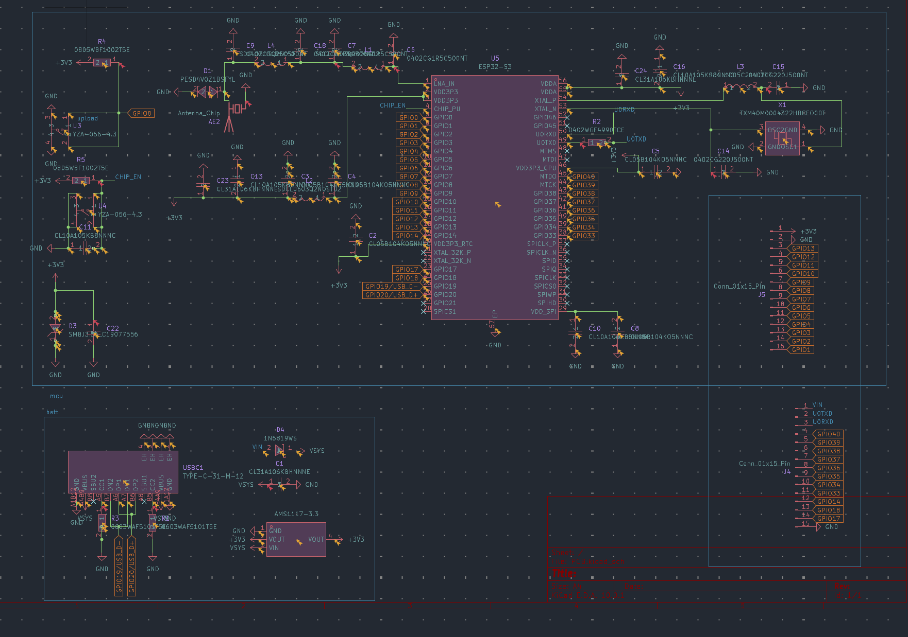
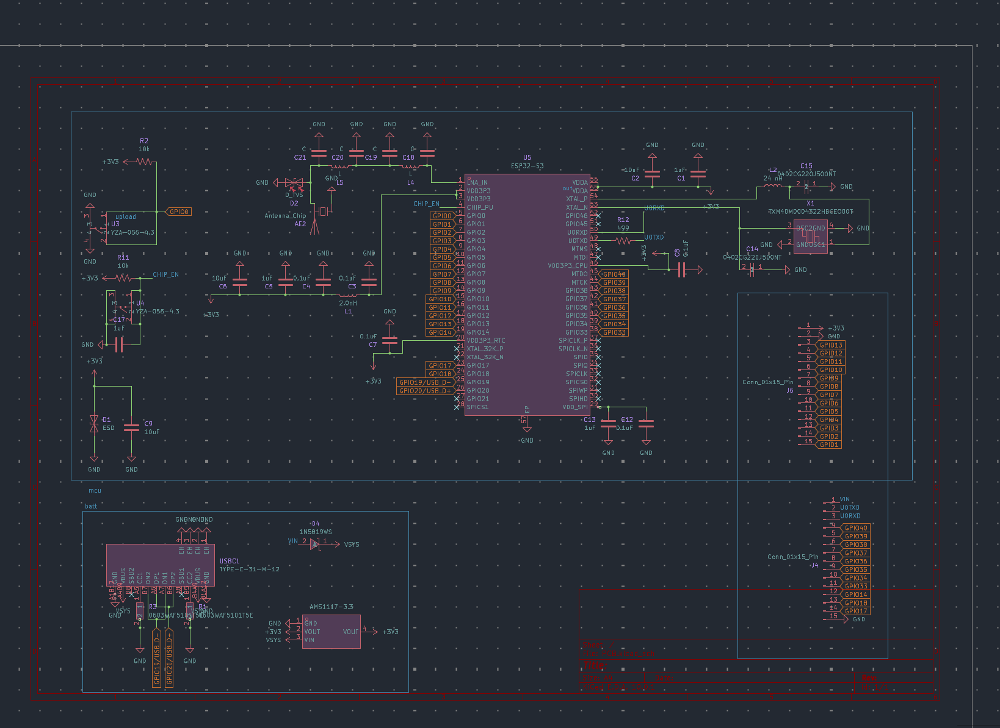
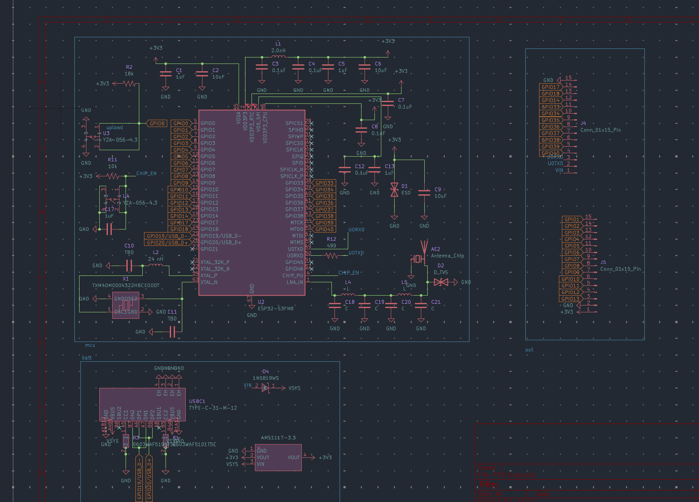
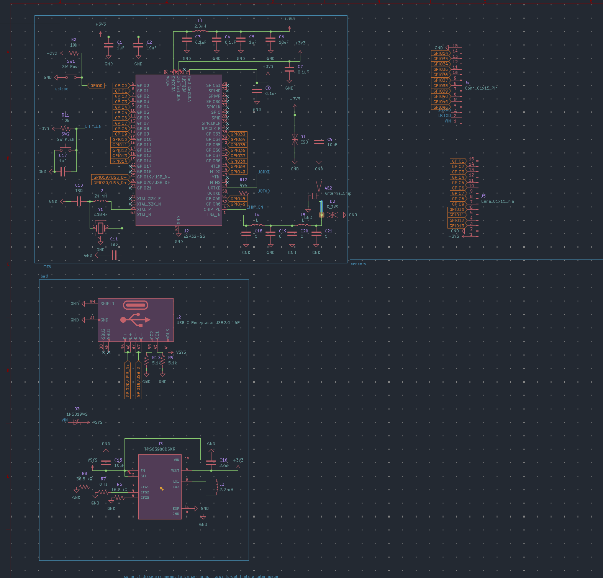
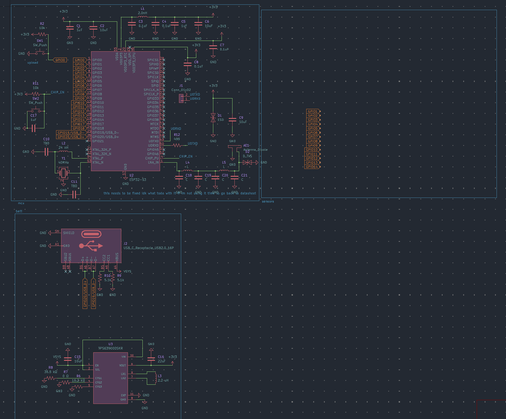

# Jul 11th: pcb wiring
i wish i was joking im writing this journal while im not even done with my wiring (half way through this session). the diff pair wiring has taken me AN HOUR. im so serious. i cannot for some reason get the width to match up and it took me >1 hour to actaully get it to work. genuienly i keep trying to fix this width and then having to fix the length and then over and over and over again. after wayy to long i have fully gotten what i believe to be as best possible solution, with the length delta to be <0.5mmish. time to move onto actaully doing ground pours! in total i logged 140 minutes but to be fair i spent a bit watching the world cup before pausing my timer so deflating to 90

**Total time spent: 1.5 hours**

# Jul 11th: schematic done
assigned a lot of footprints cross checking parts with LCSC. took me stupidly long espeically because i have been struggling a lot with deal of the capicators because there is osmehow ZERO data about capacitators for certian parts of the wiring of the antenna. Luckily i managed to find a reasonabile range and have finished ALL the footprints which took a really long time. 
I also ended up catching myself with one of my diodes, and then added a final decopuler. (erc is lying to me and half of them is like pwr flag issues which arent even real). big thanks to [@jblitzar](https://github.com/jblitzar) for advice info on capacitator information for antenna.

**Total time spent: 1.5 hours**
# Jul 11th: short jouranl but came back rq
ok so guess who changed the ENTIRE esp32 schematic cus i needed to change the footprint for BOM later (im trying to limit as much of that pick and place instruction stuff). its pretty simpel i just rewired and moved things so image sort of speaks for itself. was not fun 0/10 would not recommend.

**Total time spent: 0.25 hours**
# Jul 10+11th: worked so much turned a new day 
footprint lowk got hands. okay but in all seriousness a few things happened.
1. crashed out at kicad because it was glitching out
2. crashed out at easyeda because it wasnt so easy (i thought i had to use easyeda to use easyeda2kicad until i read the docs)
3. crashed out at kicad again (this time for finding the symobls library instead of the package manager)
4. am actively crying over sourcing parts this is so sad
okay but really from some good advice from [@hekinav](https://github.com/hekinav) i simplified a lot of my battery stuff and used an LDO instead of a buck converter (because i dont have anything to boost!!!)i also started assigning a lot of footprints which is super fun (i hate it so much) but its so satisifying to keep on going through and checking things off. self (over)deflating myself a little because i got a bit distracted yapping so going from 2 hours to listed below

**Total time spent: 1.25 hours**
# Jul 10th: sch work
yippie today has been focused on wiring stuff and getting it ready for devboard.
work includes: pin headers yay they exist now, a vin port! yippie hopefully this diode works, and i yoinked my esp32 from upstairs to figure out what to do. i also learned how antennas kinda work, and turns out its not really a thing you stick on as much as it is just traces which is kinda cool! so i imported from github. anywyas rest of time is just reviewing schematic + ect.

**Total time spent: 0.75 hours**
# July 9th: Starting
Today i mainly just imported a bunch of stuff from a previous esp project, that was incomplete. This is super helpful, because i dont have to spend as much time doing the bare chip schematic work, but will have to do a lot of pcb work, and finish it up because I never included wifi + some other things. Most work included the LNA_in + rewiring some power lines

**Total time spent: 0.5 hours**