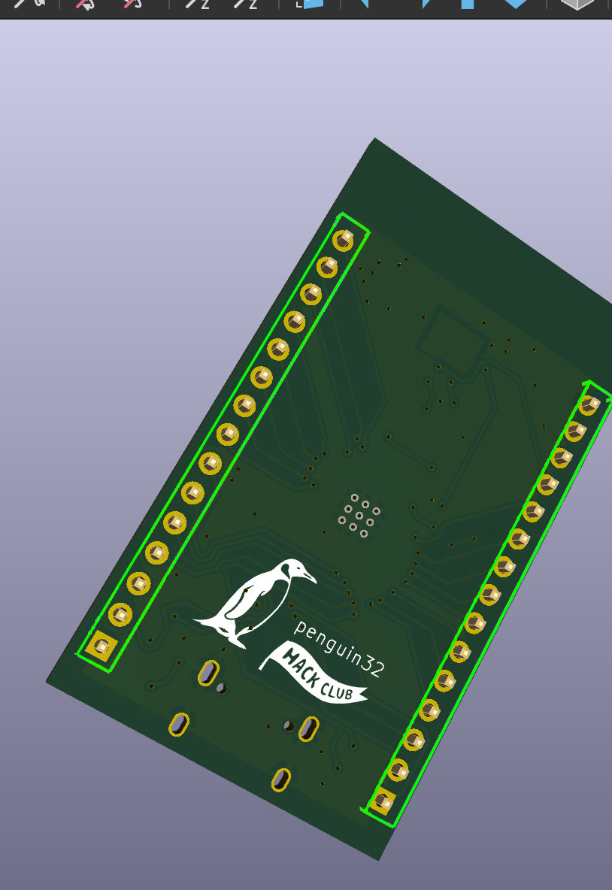
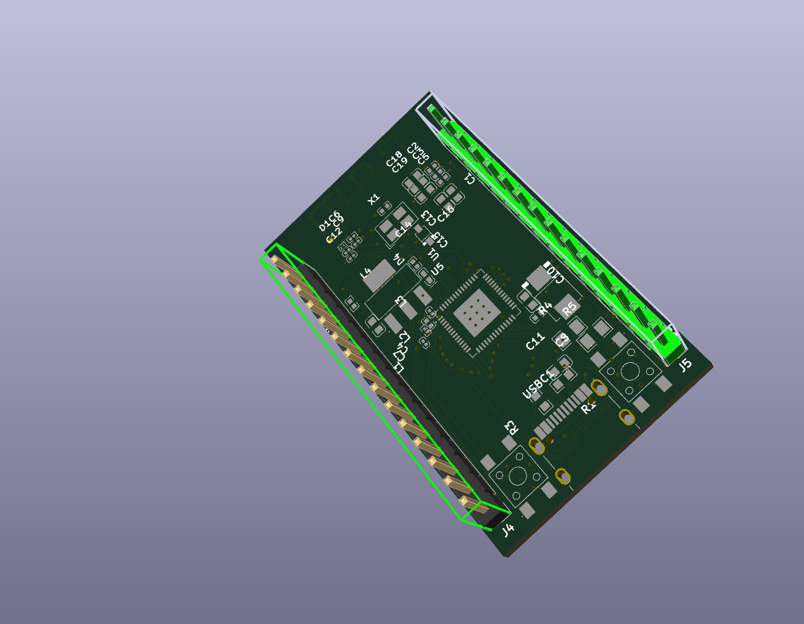
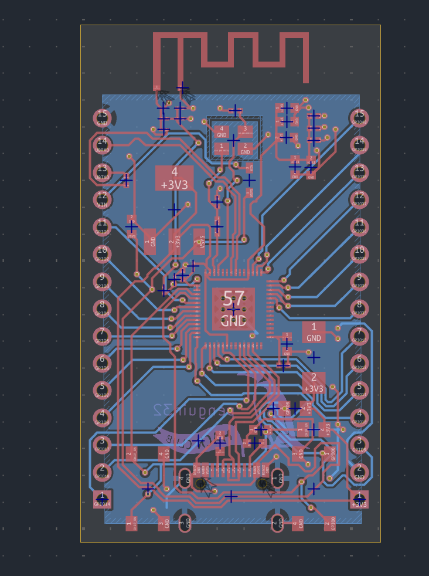
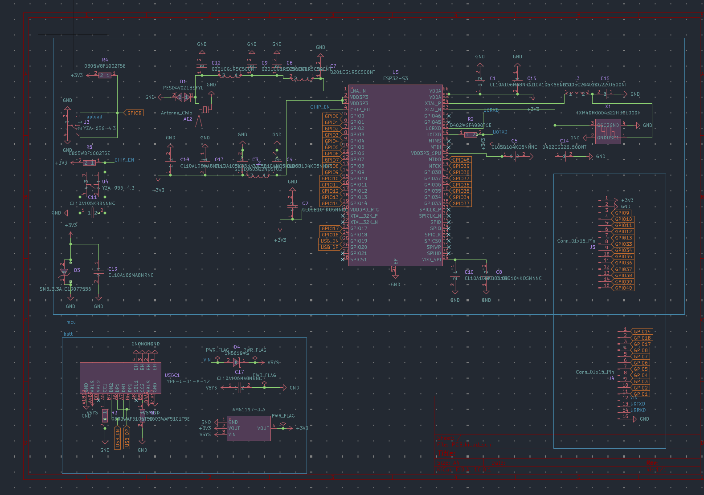
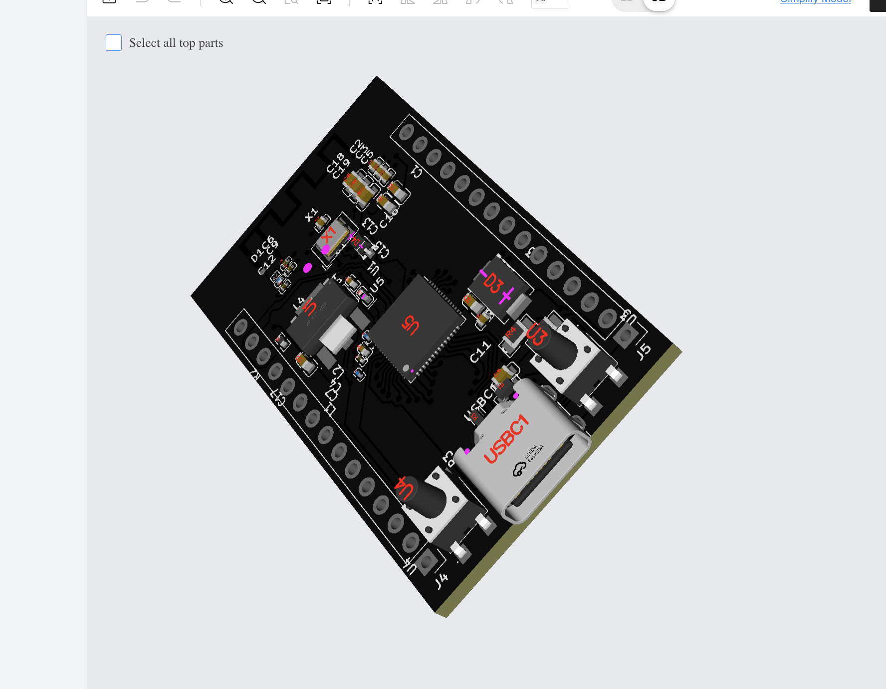

# penguin32
Penguin32 is a esp32 devboard developed on the esp32 s3fn8 board but with a big penguin on it. why penguin? why not? the main goal here was to develop and learn bare chip work

# Firmware + CAD
N/A, all the necessary programs are preflashed onto the s3 chip. Also no cad for obvious reasons, its just a devboard

# Images
Not sure why some of the models dont actaully render, and some are upside down, so forgive the pcb looking kinda odd.

# Notes
flash not needed thanks to the onboard flash. this is my first time doing bare chip development so im pretty happy with how it turned out given i did it in about 3 days to attempt to qualify for outpost. Honestly i can't believe some of the stuff (routing) took me so long, but i guess i finished at the end of the day so its fine. Also i have two seperate BOMs, a regular BOM, and then a BOM for specific pick and place components.
| Category            | Line Item             | Amount (USD) |
|---------------------|-----------------------|--------------|
| PCB Price           | Via Covering          | 0.00         |
| PCB Price           | Special Offer         | 4.00         |
| PCB Price           | Subtotal              | 4.00         |
| Standard PCBA Price | Setup Fee             | 25.56        |
| Standard PCBA Price | Stencil               | 8.21         |
| Standard PCBA Price | Panel                 | 0.00         |
| Standard PCBA Price | Large Size            | 0.00         |
| Standard PCBA Price | Components (17 items) | 27.75        |
| Standard PCBA Price | Feeders Loading Fee   | 26.01        |
| Standard PCBA Price | SMT Assembly          | 1.62         |
| Standard PCBA Price | Packaging Fee         | 0.49         |
| Standard PCBA Price | Subtotal              | 89.64        |
| Build Time          | PCB (24 hours)        | 0.00         |
| Build Time          | Assembly (3-4 days)   | 0.00         |
| Msc.                | Shipping              | 16.11        |
